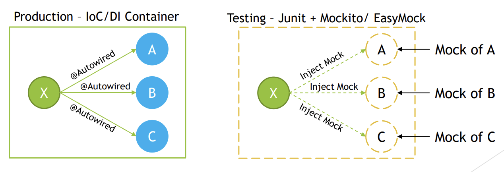
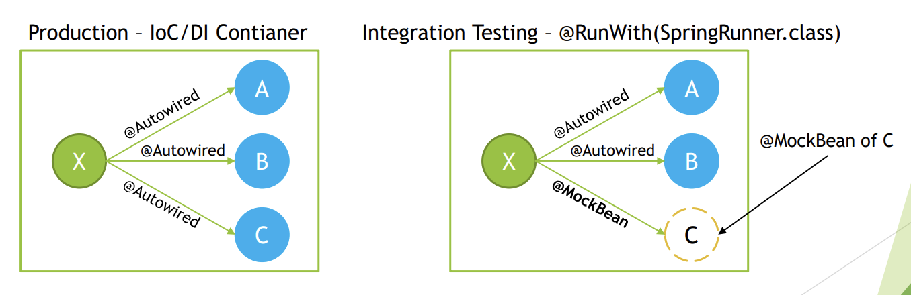
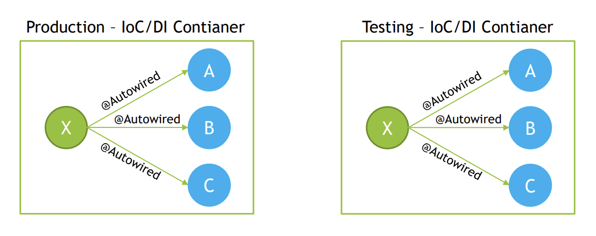
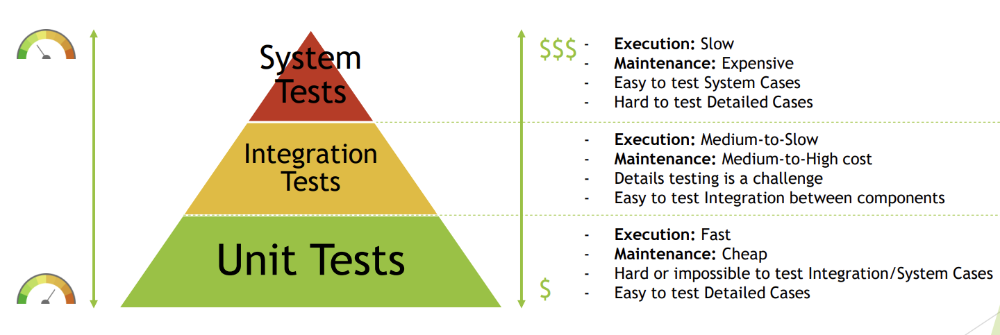
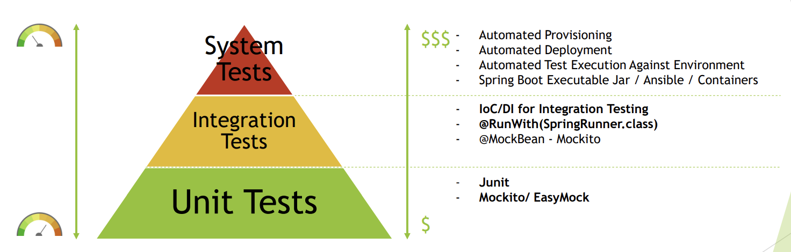

Spring Test
----------

Spring in a unit test
---------------
1. Spring Framework is usually not used in unit tests, however Spring contains some support for unit testing within following packages:
   1. `org.springframework.test.util`
      1. ORM Entities related testing – set value for private field, normally handled by ORM
      2. Manual dependency injection into private field, normally handled by @Autowired,
         @Inject
      3. @PostConstruct and @PreDestroy lifecycle callback methods testing
   2. `org.springframework.test.web`
      1. ModelAndViewAssert – Unit Testing for Spring MVC Controllers
   3. `org.springframework.mock.env`
      1. mock implementations of the Environment and PropertySource
      2. MockEnvironment, MockPropertySource
   4. org.springframework.mock.jndi
      1. Mock implementation of JNDI SPI – usually used for Java EE
   5. org.springframework.mock.web
      1. Servlet API mock objects
2. To get full understanding on why Spring is usually not used for unit tests,
   however some support for unit testing exists within framework, we need
   to get deeper into testing subject and understand differences between:
   1. Unit Tests
   2. Integration Tests
   3. System Tests
3. Having understanding on purpose and range of testing performed on each
   level will make it clear to know at which type of test Spring IoC/DI
   should be used and at which level only Spring Mocks should be used,
   without involving Spring IoC/DI.

Unit Tests
--------
1. Unit Tests 
   1. should test one unit of functionality in isolation. This unit of functionality can
      be defined as single method, class, module, component. In Object Oriented
      Programming, unit of functionality is usually defined as single class. Testing in isolation,
      means that environment of execution is not initiated during testing and should not affect
      testing process, any dependencies on environment should be mocked. All class
      collaborators should be mocked as well. Testing should be performed outside of
      container, that means that IoC/DI should not be required to create instances of objects
      under test. Tests should execute successfully as out-of-container tests.
       
   2. Here we will verify whether calls are made to expected methods with mock data
2. Integration Tests 
   1. should test multiple modules or components that are combined
      together. Those modules should be already unit tested, and on Integration Test level some
      subset of functionalities should be checked, to test if modules provide requested
      functionalities when cooperating together under environment that should be close to
      production one, however with assumptions that some of components might still be
      mocked. When performing Integration Test we want to initiate subset of system and
      execute test against it. IoC/DI Container is used for this kind of testing, with some
      simplification upon deployment or container execution.
      
3. System Tests
   1. should check required system functionality on fully running system, consisting
      of all modules and environment that is as close as possible to production one. System
      under System Tests level should already be checked on unit and integration test level, and
      on System level only subset of functionalities should be checked to fill the gaps that were
      not possible to test on unit and integration testing level. IoC/DI container is used with
      assumption that it is used in the same way as production environment.
       
4. In practice, large scale enterprise systems needs to have testing strategy defined to test
   system that is being developed in efficient manner. Often used strategy for test automation
   is “Testing Pyramid”. It assumes that Unit, Integration and System Tests are implemented,
   with right ratio on number of tests on each level.
    
5. On each level right set of tools should be used to perform testing, minimize costs and
   maximize feedback from automated tests
   
6. Examples
   1. 

