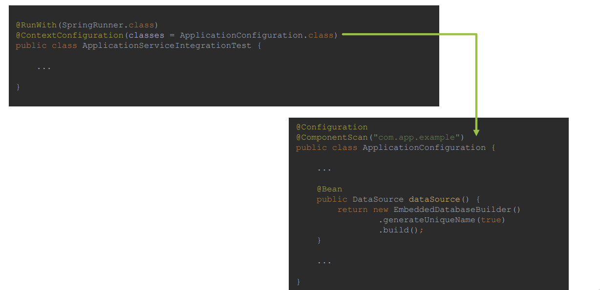

Spring Test
----------

Spring in a unit test
---------------
1. Spring Framework is usually not used in unit tests, however Spring contains some support for unit testing within following packages:
   1. `org.springframework.test.util`
      1. ORM Entities related testing – set value for private field, normally handled by ORM
      2. Manual dependency injection into private field, normally handled by @Autowired,
         @Inject
      3. @PostConstruct and @PreDestroy lifecycle callback methods testing
   2. `org.springframework.test.web`
      1. ModelAndViewAssert – Unit Testing for Spring MVC Controllers
   3. `org.springframework.mock.env`
      1. mock implementations of the Environment and PropertySource
      2. MockEnvironment, MockPropertySource
   4. org.springframework.mock.jndi
      1. Mock implementation of JNDI SPI – usually used for Java EE
   5. org.springframework.mock.web
      1. Servlet API mock objects
2. To get full understanding on why Spring is usually not used for unit tests,
   however some support for unit testing exists within framework, we need
   to get deeper into testing subject and understand differences between:
   1. Unit Tests
   2. Integration Tests
   3. System Tests
3. Having understanding on purpose and range of testing performed on each
   level will make it clear to know at which type of test Spring IoC/DI
   should be used and at which level only Spring Mocks should be used,
   without involving Spring IoC/DI.


Unit Tests
--------
1. Unit Tests 
   1. should test one unit of functionality in isolation. This unit of functionality can
      be defined as single method, class, module, component. In Object Oriented
      Programming, unit of functionality is usually defined as single class. Testing in isolation,
      means that environment of execution is not initiated during testing and should not affect
      testing process, any dependencies on environment should be mocked. All class
      collaborators should be mocked as well. Testing should be performed outside of
      container, that means that IoC/DI should not be required to create instances of objects
      under test. Tests should execute successfully as out-of-container tests.
       
   2. Here we will verify whether calls are made to expected methods with mock data
2. Integration Tests 
   1. should test multiple modules or components that are combined
      together. Those modules should be already unit tested, and on Integration Test level some
      subset of functionalities should be checked, to test if modules provide requested
      functionalities when cooperating together under environment that should be close to
      production one, however with assumptions that some of components might still be
      mocked. When performing Integration Test we want to initiate subset of system and
      execute test against it. IoC/DI Container is used for this kind of testing, with some
      simplification upon deployment or container execution.
      
   2. Spring provides great support for integration testing, with main goals of the support being:
      1. Management of Spring IoC container and IoC container caching between tests
         1. Spring will create and manage IoC container for tests
         2. Context can be reused between tests
         3. Main purpose of context being reused is to improve tests execution time
         4. Execution times of integration tests might be long mainly because of Embedded Database,
             Hibernate and other components that are created once context is created
      2. Dependency Injection in tests
         1. Allows for easy Spring Test definition with usage of `@RunWith(SpringRunner.class)`
         2. `@ContextConfiguration` can be used in tests to configure context
         3. Support for `@Autowired, @Inject ...`
         4. Allows customization with `@TestExecutionListener`
      3. Transaction management appropriate to integration testing
         1. Resolves issue with test affecting each other on data level by implementing proper transaction
            management
         2. By default, all transactions are roll-back transactions
         3. Gives ability to commit transactions if required
      4. Additionally Spring provides following tools to simplify Integration Testing:
         1. JDBC Testing Support
            1. JdbcTestUtils provides JDBC related utility functions
            2. countRowsInTable, countRowsInTableWhere, deleteFromTables,
               deleteFromTableWhere
         2. Spring MVC Testing Support
            1. Allow for easy setup with:
               1. @RunWith(SpringRunner.class)
               2. @WebAppConfiguration
               3. @ContextConfiguration
            2. Automatically creates MockMvc
         3. HtmlUnit Integration
            1. Simplifies end-to-end testing for HTML views
         4. Client-Side REST Tests
            1. Allows you to test Client code that interacts with mocked REST Service
            2. Use RestTemplate with MockRestServiceServer to make assertions on mock
         5. Spring annotations for Integration Testing
            1. `@ContextConfiguration`
               1. Allows you to specify how to load and configure an ApplicationContext for integration tests
               2. You can specify @Configuration classes that will be used during ApplicationContext
                  loading
               3. Optionally, you can specify XML configuration files locations, if you are using it instead of annotated @Configuration classes
         6. `@DirtiesContext`
            1. Marks test as one that modifies state of context, and it means that context should be recreated prior next test execution because otherwise modified context state might affect test execution]
               1. When used at class-level you can specify following modes:
                  1. BEFORE_CLASS
                  2. BEFORE_EACH_TEST_METHOD
                  3. AFTER_EACH_TEST_METHOD
                  4. AFTER_CLASS
               2. When used at method-level you can specify following modes:
                  1. BEFORE_METHOD
                  2. AFTER_METHOD
         7. `@ActiveProfiles`
            1. class-level annotation that is used to declare which bean definition profiles should be active when loading an ApplicationContext
         8. `@TestPropertySource`
            1. class-level annotation that you can use to configure the locations of properties files and inlined properties
         9. `@WebAppConfiguration`
            1. class-level annotation that triggers creation of MockServletContext, which serves as the
               ServletContext for the test’s WebApplicationContext
            2. Indicates that ApplicationContext loaded for an integration test should be a
               WebApplicationContext
         10. `@ContextHierarchy`
             1. Used when hierarchy of application contexts has to be used for integration test
         11. ` @TestExecutionListeners`
             1. Allows registration of TestExecutionListener which allows for customization of test
                execution
             2. Example of TestExecutionListener that is registered by default is
                DirtiesContextTestExecutionListener
         12. @Commit
             1. class or method level annotation
             2. indicates that after test execution, transaction should be committed
         13. `@Rollback`
             1. class or method level annotation that indicates that transaction should be rolled back after test execution
             2. Even if @Rollback is not explicitly defined, all transactions under tests will be rolled backed by default
         14. `@BeforeTransaction`
             1. Indicates method that should be executed before transaction is started
         15. `@AfterTransaction`
             1. Indicates method that should be executed after transaction is started
         16. `@Sql`
             1. Indicates SQL scripts that should be executed against database during integration test
         17. @SqlConfig
             1. Defines metadata used for SQL script parsing
         18. @SqlGroup
             1. Allows you to use multiple @Sql annotations
         19. [Source Code](SpringIntegrationTestingAnnotations/src/test/java/com/raghu/test/annotations/application/ApplicationServiceIntegrationTest.java)
         
3. System Tests
   1. should check required system functionality on fully running system, consisting
      of all modules and environment that is as close as possible to production one. System
      under System Tests level should already be checked on unit and integration test level, and
      on System level only subset of functionalities should be checked to fill the gaps that were
      not possible to test on unit and integration testing level. IoC/DI container is used with
      assumption that it is used in the same way as production environment.
       
4. In practice, large scale enterprise systems needs to have testing strategy defined to test
   system that is being developed in efficient manner. Often used strategy for test automation
   is “Testing Pyramid”. It assumes that Unit, Integration and System Tests are implemented,
   with right ratio on number of tests on each level.
    
5. On each level right set of tools should be used to perform testing, minimize costs and
   maximize feedback from automated tests
   
6. Examples
   1. [Source Code](SpringUnitTestProblem/src/test/java/com/raghu/spring/test)

shared application context
---------
1. “Shared Application Context” can be considered as:
   1. Sharing Context Definition
   2. Sharing Context Instance
2. Context Definition can be shared between tests in following way:
   1. Use Base Class for All Tests which will contain @ContextConfiguration and other
      annotations, like for example @ActiveProfiles etc.
      ```java
          @RunWith(SpringRunner.class)
             @ContextConfiguration(classes = {ApplicationConfiguration.class, TestDataConfiguration.class, MockitoConfiguration.class})
             public abstract class IntegrationTestBase {
             }
      ```
   2. Use Custom Annotation that will contain context configuration
      ```java
      @Retention(RUNTIME)
         @ContextConfiguration(classes = {ApplicationConfiguration.class, TestDataConfiguration.class, MockitoConfiguration.class})
         public @interface IntegrationTestContextConfiguration {
         }
      ```
   3. Use Test Configuration that Inherits Application Configuration
      ```java
              @Configuration
        @ContextConfiguration(classes = {TestDataConfiguration.class, MockitoConfiguration.class})
        public class IntegrationTestConfiguration extends ApplicationConfiguration {
        }

      ```
   4. Use Base Interface for all Tests that will contain context configuration
      ```java
      @ContextConfiguration(classes = {ApplicationConfiguration.class, TestDataConfiguration.class, MockitoConfiguration.class})
        public interface IntegrationTestBaseIfc {
        }
      ```
3. Context Instance is shared by default between all tests, as long as requested context
   matches one that is already cached.
   1. Context will be reused as long as @ContextConfiguration (locations, classes,
      initializers, ...), @ActiveProfiles, @TestPropertySource attributes are matched. To
      see full list of attributes that needs to be matched, you can look at
      MergedContextConfiguration class that is used as key to ContextCache.
      You can use @DirtiesContext annotation to force Spring to create new instance of
      context for test.

@Transactional in testing
-----------
1. When – you use @Transactional annotation in testing whenever you want
   to run some part of the code that can alter state of transactional resource,
   for example database. Usage of this annotation allows you to mark code that
   should execute under transaction and allows to rollback all changes made by
   test, allowing other tests to pick from clear state.
2. By default, transaction will be rolled-back for each test which was executed
   with @Transactional annotation.
   1. @Rollback – explicitly state to rollback transaction
   2. @Commit - indicates that after test execution, transaction should be
      committed
   3. @BeforeTransaction - indicates method that should be executed
      before transaction is started
   4. @AfterTransaction - indicates method that should be executed after
      transaction is started
3. Where - @Transactional can be used:
   1. On top of the class – each test method in class will be executed in
      transaction
   2. On top of the method – test method will be executed in transaction
4. Example
   ```java
           @RunWith(SpringRunner.class)
        @ContextConfiguration(classes = ApplicationConfiguration.class)
        public class ApplicationServiceIntegrationTest {
        
            private static final Guest GUEST_1 = new Guest("Michal ", "Leon");
            private static final Guest GUEST_2 = new Guest("Virgie", "Webster");
            private static final Guest GUEST_3 = new Guest("Daphne", "Archer");
        
            private static final Room ROOM_1 = new Room("Green Room", "A01");
            private static final Room ROOM_2 = new Room("Yellow Room", "A02");
            private static final Room ROOM_3 = new Room("Blue Room", "B01");
        
            @Autowired
            private ApplicationService applicationService;
        
            @Transactional
            @Test
            @Commit
            public void shouldRegisterGuests() {
                applicationService.registerGuests(GUEST_1, GUEST_2, GUEST_3);
        
                assertThat(applicationService.listGuests())
                        .have(elementsWithIdAssigned())
                        .usingElementComparator(guestComparatorWithoutId())
                        .containsExactly(
                                GUEST_1, GUEST_2, GUEST_3
                        );
            }
        
            @Transactional
            @Test
            public void shouldRegisterRooms() {
                applicationService.registerRooms(ROOM_1, ROOM_2, ROOM_3);
        
                assertThat(applicationService.listRooms())
                        .have(elementsWithIdAssigned())
                        .usingElementComparator(roomComparatorWithoutId())
                        .containsExactly(
                                ROOM_1, ROOM_2, ROOM_3
                        );
            }
        
            @BeforeTransaction
            private void beforeTransaction() {
                System.out.println("BEFORE TRANSACTION");
            }
        
            @AfterTransaction
            private void afterTransaction() {
                System.out.println("AFTER TRANSACTION");
            }
        
            private Comparator<Guest> guestComparatorWithoutId() {
                return Comparator
                        .comparing(Guest::getFirstName)
                        .thenComparing(Guest::getLastName);
            }
        
            private Comparator<Room> roomComparatorWithoutId() {
                return Comparator
                        .comparing(Room::getName)
                        .thenComparing(Room::getSection);
            }
        
            private Condition<? super Identifiable> elementsWithIdAssigned() {
                return new Condition<>() {
                    @Override
                    public boolean matches(Identifiable identifiable) {
                        return identifiable.getId() > 0;
                    }
                };
            }
        }

   ```

Mockito or EasyMock
------------
1. Mock Frameworks like Mockito or EasyMock are used mainly during Unit Testing to
   mock collaborators of classes under test. Mockito or EasyMock can be also used
   during Integration Testing when goal is to check cooperation between different
   objects, while still mocking part of the system.
2. Mock created with Mockito or EasyMock is a dynamic object, which can
   “pretend” real object and return predefined results when invoking method on it.
   Additionally Mock allows you to verify if expected method were indeed called
   with expected arguments.
3. Above frameworks also allows you to inject mocks to classes under test in
   convenient way, with usage of annotations, with style similar to IoC/DI without
   having to run within container at all, which is one of the reason why unit tests
   are so fast and lightweight.
4. Mockito usage in Unit Test
   
5. Mockito usage in Integration Test – prefer usage of @MockBean is using Spring Boot
   
6. EasyMock usage in Unit Test
   
7. EasyMock usage in Integration Test
   


@ContextConfiguration
----------------
1. @ContextConfiguration annotation is used on top of the `class that
   represents Integration Test`, and it’s purpose is to specify how to load and
   configure Application Context for Integration Test.
   
2. @ContextConfiguration annotation can be used in two basic modes:
   1. Annotated Classes Based Approach
   2. XML Based Approach
3. When @ContextConfiguration annotation is used with Annotated Classes
   Approach, it is expected for classes field to point to class or list of classes that
   represents @Configuration classes, which will contain information about
   @ComponentScan or will provide @Bean(s).
   
4. When @ContextConfiguration annotation is used with XML Based Approach,
   it is expected for locations field to point to context xml definitions or list of
   context xml definitions
   
5. Additionally @ContextConfiguration annotation also allows you to specify:
   1. initializers – list of ApplicationContextInitializer, used within cases that
      require some programmatic initialization of the application context
   2. loader – usually not used and default DelegatingSmartContextLoader is
      used, if required, this field allows you to specify custom context loader or one of
      the following:
      1. GenericXmlContextLoader
      2. GenericGroovyXmlContextLoader
      3. AnnotationConfigContextLoader
      4. GenericXmlWebContextLoader
      5. ...
   3. name - name of the context hierarchy level represented by this configuration, only
      applicable when used within a test class hierarchy configured using
      @ContextHierarchy
   4. inheritLocations - whether or not xml locations or annotated classes from test
      superclasses should be inherited, default true
   5. inheritInitializers - whether or not context initializers from test superclasses
      should be inherited, default true

simplifying writing tests - Spring Boot
-----------------
1. Spring Boot simplifies writing tests in following way:
   1. Provides `@SpringBootTest` annotation - alternative to
      @ContextConfiguration, creates ApplicationContext through
      SpringApplication, Enables Tests Auto-Configuration, Enables Spring Boot
      Test Features
   2. Provides `@MockBean` annotation – easy creation and injection of Mockito
      mock
   3. Provides `@SpyBean` annotation - easy creation and injection of Mockito spy
   4. Provides` @WebMvcTest` annotation - useful when test focuses only on Spring
      MVC components, disables full auto-configuration and applies only
      configuration relevant to MVC tests
   5. Provides Web Environments
      1. MOCK (default)
      2. RANDOM_PORT
      3. DEFINED_PORT
      4. NONE
2. Provides algorithm for Tests Environment Auto-Configuration
   1. Based on defined dependencies, beans, properties, resources provides beans
      necessary for integration tests
   2. Allows you to focus on test content instead of focusing on how to configure
      specified technology for integration test
3. Allows to explicitly use Auto-Configurations:
   1. @JsonTest - Auto-configured JSON Tests
   2. @WebMvcTest - Auto-configured Spring MVC Tests (context limited to MVC)
   3. @JdbcTest - Auto-configured JDBC Tests
   4. @DataJpaTest - Auto-configured Data JPA Tests
   5. @JooqTest - Auto-configured jOOQ Tests
   6. @DataMongoTest - Auto-configured Data MongoDB Tests
   7. @RestClientTest - Auto-configured REST Clients
4. Provides spring-boot-starter-test module, which includes:
   1. JUnit
   2. Spring Test
   3. Spring Boot Test
   4. AssertJ - fluent assertion library.
   5. Hamcrest - library of matcher objects
   6. Mockito - mocking framework.
   7. JSONassert - An assertion library for JSON
   8. JsonPath - XPath for JSON
5. Provides @Conditional annotations
   1. @ConditionalOnClass
   2. @ConditionalOnMissingBean
   3. @ConditionalOnProperty
   4. @ConditionalOnResource
   5. @ConditionalOnExpression
6. [Source Code](SpringBootTesting/src/test/java/com/raghu/springboot/test)


@SpringBootTest - Working
------------------------
1. @SpringBootTest annotation provides following features over regular Spring Test Context:
   1. Automatically searches for @SpringBootConfiguration
      1. ...unless nested @Configuration is detected or explicit
         @SpringBootTest(classes=...) is specified
      2. In most cases @SpringBootConfiguration is not explicitly used, it is inherited from
         @SpringBootApplication used in production code to indicate starting place for
         application
      3. @SpringBootConfiguration is an alternative to standard @Configuration,
         advantage is that @SpringBootConfiguration can be found automatically in tests
   2. Sets default ContextLoader to SpringBootContextLoader
      1. ...unless one is explicitly specified in @ContextConfiguration(loader=...)
      2. SpringBootContextLoader is specific ContextLoader that starts tests using
         SpringApplication
   3. Provides Web Environments
      1. MOCK (default)
      2. RANDOM_PORT
      3. DEFINED_PORT
      4. NONE
   4. Allows to easily define Environment properties
      1. properties field of @SpringBootTest annotation can be used to define key=value
         pairs that will be added to Environment before tests execution
   5. Registers TestRestTemplate and WebTestClient
   6. @SpringBootTest annotation allows you to set following fields:
      1. classes - annotated classes to use for loading an ApplicationContext
      2. If not set, @SpringBootTest will automatically search for
         @SpringBootConfiguration which is usually inherited from
         @SpringBootApplication
      3. properties - key=value pairs that will be added to Environment before
         tests execution
      4. webEnvironment – one of specified web environment used for web layer
         testing:
         1. MOCK (default)
         2. RANDOM_PORT
         3. DEFINED_PORT
         4. NONE
2. @SpringBootTest annotation interacts with @SpringBootApplication
   and @SpringBootConfiguration through
   SpringBootTestContextBootstrapper and SpringBootContextLoader.
3. Goal of SpringBootContextLoader is to transform initial
   ContextConfiguration to ApplicationContext.
   SpringBootContextLoader will get as input class annotated with
   @SpringBootConfiguration, which will be located by
   SpringBootTestContextBootstrapper.
4. Algorithm that searches for class annotated with @SpringBootConfiguration
   will start at package where test class is located and will scan this package and all
   parent packages in search for @SpringBootApplication.
   


   


